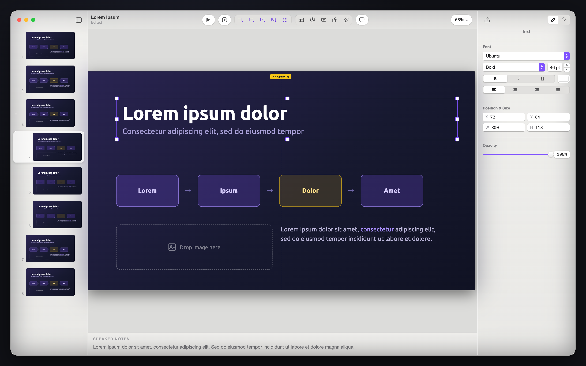

# Cupboard

A Keynote-style presentation editor for developers who present code. Cross-platform desktop: macOS, Windows, Linux.

- Slides are a serializable document; play mode (steps, builds, speaker window, export) is driven by [CuP](https://github.com/KodeinKoders/CuP)
- Native app per platform (SwiftUI, WinUI 3, Compose Desktop), one shared Compose slide canvas, is the [board](https://github.com/xxfast/Cupboard) 

<picture>
  <source media="(prefers-color-scheme: dark)" srcset="design/mockups/macos-fit.dark.png">
  <source media="(prefers-color-scheme: light)" srcset="design/mockups/macos-fit.light.png">
  
</picture>

> [!WARNING]
> 🚧 Early work in progress!

## Layout

- [`cupboard/`](./cupboard) is the KMP library where the bulk of the app lives: document model, slide renderers, editor canvas
- [`desktopApp/`](./desktopApp) is the Compose for Desktop shell, which is the Linux app and the fallback shell everywhere else
- [`macosApp/`](./macosApp) builds `CupboardCanvas.framework` and the SwiftUI host that embeds it ([`Cupboard.xcodeproj`](./macosApp/Cupboard.xcodeproj))
- [`cup/`](https://github.com/xxfast/CuP) and [`emoji-kt/`](https://github.com/xxfast/Emoji.kt) are fork submodules of CuP and Emoji.kt
- [`design/`](./design) holds the HTML design prototypes and the UI spec

See [`GOALS.md`](./GOALS.md) for what we're building and why, [`ROADMAP.md`](./ROADMAP.md) for the order we're building it in.

## Running

Clone with submodules: `git clone --recursive`, or `git submodule update --init` after a plain clone.

- Desktop, hot reload: `./gradlew :desktopApp:hotRun --auto`
- macOS SwiftUI host: `./macosApp/run.sh`
- Tests: `./gradlew :cupboard:allTests`, or `:cupboard:jvmTest` for the quick loop
